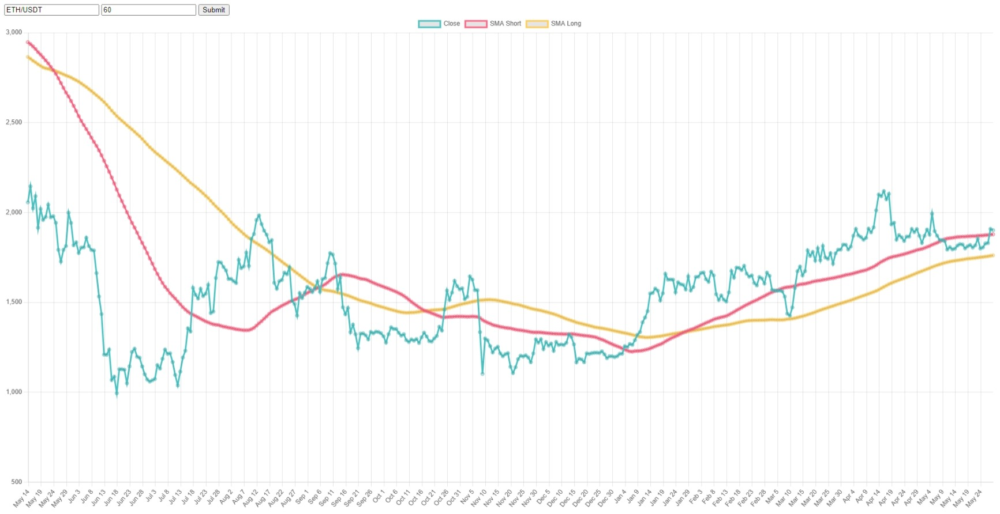

# Simple Trading Advisor App

## Description

The Trading Advisor App is a web application that provides visualizations and analysis of trading data. It displays price charts with simple moving averages (SMA) and identifies intersections of the SMAs, which can be used as potential trading signals. The app fetches data from a cryptocurrency exchange using the CCXT library and performs SMA calculations to generate the chart and intersections.

## Features

- Display of price chart with close prices, SMA Short, and SMA Long.
- Dynamic updating of the chart based on user input for asset and window size.
- Calculation of SMA intersections as potential trading signals.
- Custom markers on the chart to indicate SMA intersections.

## Technologies Used

- Python: Backend development, data fetching, SMA calculations.
- Flask: Web framework for handling requests and serving data.
- Pandas: Data manipulation and calculations.
- CCXT: Cryptocurrency exchange API for fetching trading data.
- JavaScript: Frontend development, chart rendering using Chart.js library.
- HTML/CSS: User interface and styling.
- jQuery: AJAX requests and event handling.

## Setup Instructions

1. Clone the repository to your local machine.
2. Install the required Python packages using `pip install -r requirements.txt`.
3. Run the Flask app using `python app.py`.
4. Open the web app in your browser at `http://localhost:5000`.

## Usage

1. Open the web app in your browser.
2. Enter the desired asset (e.g., ETH/USDT) and window size in the input fields.
3. Press the Submit button to fetch and display the chart.
4. The chart will show the close prices, SMA Short, and SMA Long.
5. The chart will be updated dynamically when changing the asset or window size.
6. Intersections of the SMAs will be displayed as custom markers on the chart.

## Contributing

Contributions to the Trading Advisor App are welcome! If you find any issues or have ideas for enhancements, please submit a pull request or open an issue on the GitHub repository.

## License

This project is licensed under the MIT License. See the `LICENSE` file for more details.
